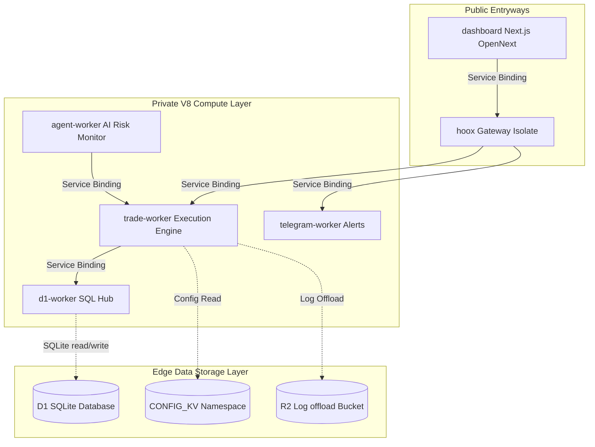

<!--
  Copyright (c) 2026 HOOX · jango-blockchained (hoox-sh)
  SPDX-License-Identifier: CC-BY-4.0
-->

---
title: "⚙️ DevOps Manual"
description: "Infrastructure provisioning, deployment sequences, secret management, and edge operations reference for Hoox administrators."
---

<Tip>
  This manual is the primary, production-grade reference for system
  administrators, security engineers, and platform operators responsible for
  provisioning edge databases, orchestrating secure V8 service bindings,
  deploying multi-exchange execution workers, auditing secrets, and monitoring
  system health. Day-to-day ops are **CLI-first**: `hoox` / `hx` for
  `onboard`, `setup`, `deploy`, `secrets`, `check health`, and `doctor`.
</Tip>

---

## Docs navigation (tabs)

HOOX docs use the same **multi-tab** layout as AXIS / PYNE. This **DevOps** tab is for install, local development, deploy, security, and tooling. Sibling tabs hold the rest of the platform:

| Tab | Contents |
| --- | -------- |
| [End User](/docs/enduser) | Getting started, concepts, guides, tutorials |
| [Architecture](/docs/devops/architecture) | Topology, data flow, storage, ADRs |
| [Workers](/docs/devops/workers) | Per-isolate profiles |
| **DevOps** (this page) | Setup, development, deployment, security, CLI/TUI |
| [API](/docs/devops/api) | HTTP endpoints, payloads, responses |
| [Enterprise](/docs/enterprise) | Multi-tenancy, compliance (commercial notes) |

---

## 🗺️ Operator's System Directory

### 1. Setup runbooks

- **[Operations & Troubleshooting](/docs/devops/setup-and-operations)** — Deploy order, secrets modes, health probes, repair.
- **[Core Installation Flow](/docs/devops/installation-flow)** — `hoox onboard` / monorepo remember path / setup gates.
- **[Bindings registry](/docs/devops/bindings)** — Cross-worker binding inventory.

### 2. Development

- **[Wrangler Dev Setup](/docs/devops/development/local-dev)** · **[Testing](/docs/devops/development/testing)** · **[Debugging](/docs/devops/development/debugging)**

### 3. Deployment, WAF & CI/CD

- **[Production Deployment](/docs/devops/deployment/production)** — Wrangler, account provisioning, production vars.
- **[CI/CD](/docs/devops/deployment/cicd)** — GitHub Actions and edge uploads.
- **[Monitoring](/docs/devops/deployment/monitoring)** — Logs and Analytics Engine.
- **[Zero Trust](/docs/devops/deployment/zero-trust)** · **[Private Ingress](/docs/devops/deployment/private-ingress)**

### 4. Security & tooling

- **[Security overview](/docs/devops/security/overview)**
- **[CLI features](/docs/devops/cli-features)** (0.11.x: monorepo remember, secrets modes, Linear Rail banner, setup gates) · **[TUI](/docs/devops/tui)** · **[Pattern consolidation](/docs/devops/refactoring/workers-pattern-consolidation)**

### 5. Related tracks (other tabs)

- **[Architecture hub](/docs/devops/architecture)** · **[Workers hub](/docs/devops/workers)** · **[API hub](/docs/devops/api)**
- **[Test Trading](/docs/enduser/guides/test-trading)** — sandbox mode across the mesh

---

<Tip>
  First production deploy? Start with
  **[Production Deployment](/docs/devops/deployment/production)** to verify Cloudflare
  permissions and sequential worker rollout.
</Tip>

### Quick links

- **[Documentation home](/docs)** — All category hubs  
- **[Enterprise](/docs/enterprise)** — Multi-tenancy and compliance notes  
- **[OPEN_CORE.md](../../OPEN_CORE.md)** — Open-core vs commercial split
