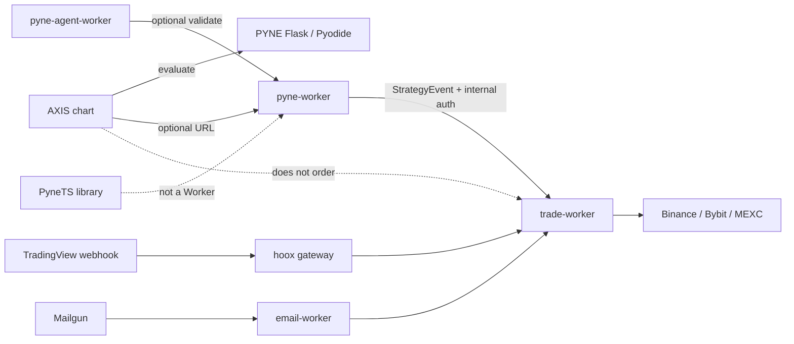

<!--
  Copyright (c) 2026 HOOX · jango-blockchained (hoox-sh)
  SPDX-License-Identifier: CC-BY-4.0
-->

---
title: "Product ecosystem"
description: "HOOX, PYNE, PyneTS, AXIS, pyne-worker, and pyne-agent-worker — what each surface does."
---

# Product ecosystem

HOOX is the **execution mesh**. It is not the Pine language, and it is not the chart. The family splits those jobs on purpose.

<Tip>
  Use this page when a name with "pyne" or "pine" appears in a worker list, a CLI, or a dashboard tile. The wrong hop is usually "I charted a strategy, so it should have traded."
</Tip>

## Abstract

| Product | Job | Docs |
| --- | --- | --- |
| **HOOX** | Signal in → risk → CEX/DEX hop → notify | this site |
| **PYNE** | Pine parse / evaluate (`hoox-pyne`, `Runtime.run`) | [hoox.sh/pyne/docs](https://hoox.sh/pyne/docs) |
| **PyneTS** | TypeScript library `@hoox-sh/pynets` | [PyneTS](https://hoox.sh/pyne/docs/pynets) |
| **pyne-worker** | Python Cloudflare isolate, `POST /run` | [isolate](/docs/devops/workers/pyne-worker) · [PYNE docs](https://hoox.sh/pyne/docs/pyne-worker) |
| **pyne-agent-worker** | Natural language → Pine | [agent](https://hoox.sh/pyne/docs/agent) |
| **AXIS** | Charting PWA | [hoox.sh/axis/docs](https://hoox.sh/axis/docs) |

## Conceptual model

## Interface surface

### What executes a live order

Only **trade-worker** holds exchange keys. Paths that reach it:

- HOOX gateway `POST /webhook` (TradingView / HTTP), after `WEBHOOK_API_KEY_BINDING`
- email-worker `POST /email-signal` (Mailgun HMAC or internal JSON)
- telegram-worker commands (allowlisted)
- **pyne-worker** `TRADE_SERVICE` on `StrategyEvent` (`X-Internal-Auth-Key`)

AXIS `engine.run` is **not** on that list.

### What evaluates Pine

- PYNE library / CLI / Flask Pro API `:5002`
- pyne-worker `POST /run`
- AXIS Pyodide wheel (offline, no Numba)
- PyneTS `Runtime.run` in **your** TypeScript process

See [PYNE modes](https://hoox.sh/pyne/docs/enduser/reference/modes).

## Internals

| Repo | Role |
| --- | --- |
| `hoox-sh/hoox` | Mesh, CLI, TUI, dashboard |
| `hoox-sh/pyne` | Language SoT |
| `hoox-sh/pynets` | TS library |
| `hoox-sh/pyne-worker` | Edge evaluate isolate (submodule under `workers/pyne-worker`) |
| `hoox-sh/axis` | PWA |
| `hoox-sh/pyne-agent-worker` | Authoring agent |

## Invariants

1. **Alerts are not orders.** `alert()` → `ALERT_WEBHOOK_URL` unless you deliberately point that URL at the gateway.
2. **11 compute surfaces**, not 9: 10 workers + dashboard.
3. Email is **Mailgun**, not IMAP.
4. `apiKey` on a webhook is stripped at the gateway; it is not a trade-worker field.

## Worked examples

| You want | Do this |
| --- | --- |
| Chart a script | AXIS + Flask or Pyodide |
| Evaluate at the edge | `hoox pyne deploy` |
| Trade from strategy events | [PYNE live trading](/docs/enduser/guides/pyne-live-trading) |
| Embed TS evaluate | `bun add @hoox-sh/pynets` |
| Chat → script | pyne-agent-worker plugin in AXIS |

## See also

- [How Hoox works](/docs/enduser/concepts/how-hoox-works)
- [PYNE live trading](/docs/enduser/guides/pyne-live-trading)
- [AXIS and HOOX](/docs/enduser/guides/axis-and-hoox)
- [pyne-worker isolate](/docs/devops/workers/pyne-worker)
- [PYNE ecosystem](https://hoox.sh/pyne/docs/reference/ecosystem)
