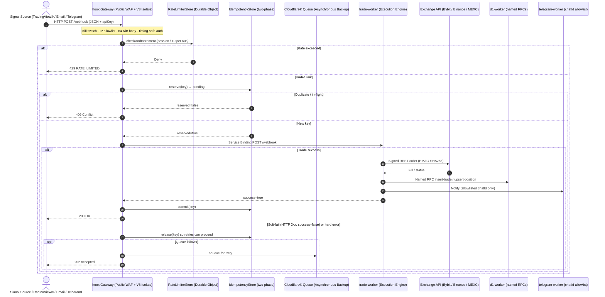

<!--
  Copyright (c) 2026 HOOX · jango-blockchained (hoox-sh)
  SPDX-License-Identifier: CC-BY-4.0
-->

---
title: "How Hoox Works"
description: "High-level overview of the pipeline turning a trade signal into an executed edge order."
---

At its core, **Hoox** functions as a highly resilient, low-latency pipeline that intercepts trading signals from external sources, validates and decodes the payloads, and converts them into cryptographically signed order placements on global exchanges in milliseconds.

Here is the exact lifecycle of an edge trade execution, from alert trigger to brokerage fill.

---

## 🗺️ The Execution Pipeline

---

## 🔍 Detailed Pipeline Phase Analysis

### 1. Signal Arrival & Ingestion

Signals represent specific instructions to buy, sell, or close positions. Hoox ingests these instructions through three primary channels:

- **TradingView® Webhooks**: High-integrity trade alerts configured via Pine Script™ (`//@version=6`) that issue JSON POST payloads to your gateway's public `/webhook` route.
- **Telegram Commands**: Direct user commands sent to your private Telegram Bot (e.g. `/trade buy btc quantity=0.01 exchange=bybit`), parsed via your webhook router.
- **Email Signals**: Secure email triggers forwarded from specialized alerts (e.g. TradingView® email alerts), parsed natively by `email-worker`.

---

### 2. Edge Firewall & Gateway Validation

When a signal hits your public endpoint, the **`hoox` gateway** interceptor immediately evaluates the request inside a sandboxed V8 isolate:

<ol>
  <li>
    <strong>API Key Authorization</strong>: Authenticates the payload's{" "}
    <code>apiKey</code> property against your secure manifest stored in
    Cloudflare® KV.
  </li>
  <li>
    <strong>IP Allow-listing</strong>: Verifies that the client IP matches a
    authorized IP range in KV (essential for restricting access solely to
    TradingView®'s known webhook IPs).
  </li>
  <li>
    <strong>Global Kill Switch check</strong>: Ensures{" "}
    <code>trade:kill\_switch</code> is <code>false</code>. If <code>true</code>,
    the pipeline aborts immediately to protect your capital.
  </li>
  <li>
    <strong>Rate Limiting</strong>: Atomic{" "}
    <code>RateLimiterStore</code> Durable Object when bound (else KV /
    in-memory). Default: <strong>10 requests / 60s</strong> per session.
    Exceeded → <code>429</code>.
  </li>
  <li>
    <strong>Two-phase idempotency</strong>:{" "}
    <code>IdempotencyStore</code> <strong>reserves</strong> the key as{" "}
    <code>pending</code> before dispatch, <strong>commits</strong> only on
    true success, and <strong>releases</strong> on soft-fail or error so
    retries can proceed. Missing DO is <strong>fail-closed</strong> (
    <code>503</code>). Duplicates → <code>409</code>. Prefer a client{" "}
    <code>idempotencyKey</code> / <code>Idempotency-Key</code> header; auto
    fingerprints include a per-minute time bucket. See{" "}
    <a href="/docs/enduser/concepts/idempotency">Idempotency</a>.
  </li>
  <li>
    <strong>Notify chat allowlist</strong>: Telegram{" "}
    <code>chatId</code> must be listed when allowlists are configured
    (fail-closed for unlisted IDs).
  </li>
</ol>

---

### 3. Service Binding Order Routing

Once validated, the gateway bypasses public internet routing and calls the internal **`trade-worker`** directly via **Service Bindings**:

- **Low Latency**: Communication occurs within a microsecond inside the V8 engine, with zero TCP handshakes or TLS decryption overhead.
- **Private Isolation**: The `trade-worker` does not expose any public URL, remaining completely isolated from external attacks.
- **Dynamic Exchange Routing**: The worker parses the symbol (e.g. `BTCUSDT`) and evaluates your KV config. If Bybit is undergoing maintenance, you can instantly redirect trades to MEXC or Binance with one command.

---

### 4. Exchange Execution & Cryptographic Signing

The `trade-worker` loads your encrypted API credentials from Cloudflare Secrets, computes the HMAC-SHA256 signature for the order parameters, and pushes the signed request to the exchange's nearest API gateway:

- **Smart Placement**: Because Smart Placement is enabled, Cloudflare automatically runs your worker on the physical edge node located geographically closest to the exchange's servers (e.g. Frankfurt for Bybit, Tokyo for Binance), cutting network transit time by up to 60%.

---

### 5. Persistent D1 Logging & Telemetry

Upon receipt of the order response (e.g. `Filled`, `Partial`, or `Rejected`), Hoox updates your ledger:

- **D1 via named RPCs**: Hot-path writes use fixed templates (`/rpc/insert-trade`, `/rpc/upsert-position`, `/rpc/insert-system-log`) and reads use `/rpc/list-signals`, `/rpc/list-system-logs`, `/rpc/list-open-positions` — not free-form `/query` for trading paths.
- **Background work**: Persistence and analytics ride `safeWaitUntil` so the isolate does not drop work when the response returns.
- **R2 Log Offloading**: Offloads full JSON request-response packets to R2 to keep D1 compact.

---

### 6. User Notifications & Alerts

Finally, the `trade-worker` pings **`telegram-worker`** via an internal binding:

- You receive an immediate Telegram notification on your phone detailing the symbol, filled price, order status, and transaction ID.
- Twice-daily, `report-worker` uses Browser Rendering to compile beautiful HTML reports of your trading metrics, generating PDFs and dropping the link directly in your chat.

---

<Tip>
  If the exchange API experiences transient network dropouts or severe rate
  limits, the Hoox Gateway automatically transfers the payload to **Cloudflare
  Queues** with an exponential retry schedule (`30s` → `1m` → `5m` → `15m`),
  keeping your strategy fully reliable even during periods of heavy market
  volatility.
</Tip>

### 🔗 Next Steps

- [**Edge-First Architecture**](/docs/enduser/concepts/edge-architecture) — Understand the absolute latency benefits of edge workers vs VPS.
- [**Signals & Trade Specifications**](/docs/enduser/concepts/signals-and-trades) — Analyze the complete JSON webhook and order formatting.
