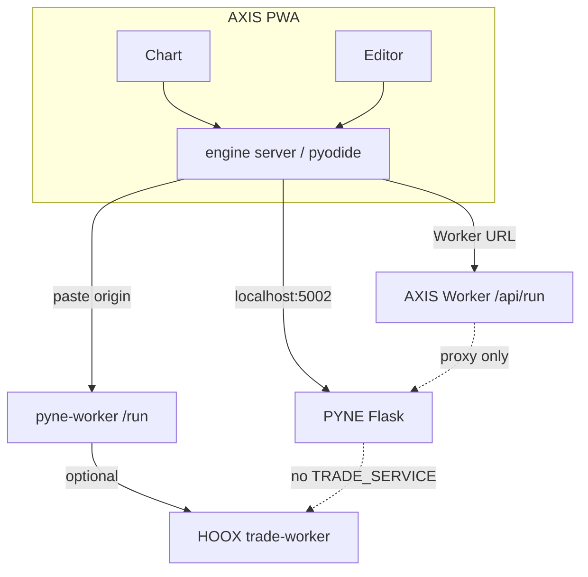

<!--
  Copyright (c) 2026 HOOX · jango-blockchained (hoox-sh)
  SPDX-License-Identifier: CC-BY-4.0
-->

---
title: "AXIS and HOOX"
description: "AXIS evaluates Pine on a chart. HOOX executes orders. Connecting them is optional and goes through pyne-worker, not the PWA."
---

# AXIS and HOOX

AXIS is the **chart**. HOOX is the **mesh**. They share a language (PYNE) and a website tab pattern. They do not share an order router.

<Tip>
  If a strategy looks correct on [axis.hoox.sh](https://axis.hoox.sh) and nothing hits the exchange, that is working as designed.
</Tip>

## Abstract

AXIS engines (`server`, `pyodide`) call PYNE. The HOOX **pyne-worker** isolate can be that `server` Backend URL. Only if **pyne-worker** has `TRADE_SERVICE` + `INTERNAL_KEY_BINDING` do strategy events become live orders. The PWA never holds exchange keys.

## Conceptual model

## Interface surface

| AXIS action | HOOX effect |
| --- | --- |
| Engine `pyodide` | None |
| Engine `server` → Flask `:5002` | None (unless you built a custom forwarder) |
| Engine `server` → AXIS Worker | Proxy / 503 — still no trade-worker |
| Engine `server` → pyne-worker origin | Evaluate. Orders **only** if isolate forwarding is on |
| Local Alerts panel webhook | Your URL. Not certified as a trade path |
| PYNE Agent plugin | Writes scripts; optional validate via `/run` |

AXIS Worker (`pynescript-axis`, `pynescript-axis.cryptolinx.workers.dev`) is **not** the HOOX `pyne-worker` isolate.

Full engine table: [AXIS evaluation map](https://hoox.sh/axis/docs/architecture/evaluation).

## Internals

| Product | Default evaluate host |
| --- | --- |
| AXIS desk | Flask `http://localhost:5002` |
| AXIS offline | Pyodide + vendored `pynescript` wheel |
| HOOX live Pine | `workers/pyne-worker` |

PyneTS (`@hoox-sh/pynets`) is a TypeScript **library**. AXIS does not load it. You can build your own host with it; that host is still not HOOX until you implement the trade hop.

## Invariants

1. **AXIS ≠ execution.**
2. **AXIS ≠ engine** — evaluation is always a plugin.
3. Pasting a HOOX gateway webhook into AXIS alerts is **not** the supported live-trading path. Use [PYNE live trading](/docs/enduser/guides/pyne-live-trading).
4. Runtimes Hub entries for "pyne-worker" vs "AXIS Worker" are different origins.

## Worked examples

### Research only

AXIS + Pyodide or local Flask. No HOOX secrets.

### Research + same evaluate host as prod

Set AXIS Backend URL to the pyne-worker origin. Run with tiny size / `test` first. Confirm you understand that **the Worker**, not the PWA, is what may forward events.

### Authoring

Install the PYNE Agent component plugin, generate a script, evaluate on Flask, then (separately) register that source on pyne-worker cron.

## Failure modes

| Symptom | Cause | Fix |
| --- | --- | --- |
| Great backtest, flat account | No trade hop | Deploy pyne-worker forwarding |
| 503 `NO_BACKEND` in AXIS | AXIS Worker has no `EXTERNAL_BACKEND` | Set it, or use Pyodide / Flask |
| Confused two Worker URLs | `pynescript-axis` vs `pyne-worker` | Check the hostname |
| Discord alert, no fill | Alert webhook ≠ `TRADE_SERVICE` | Expected |

## See also

- [Ecosystem](/docs/enduser/concepts/ecosystem)
- [PYNE live trading](/docs/enduser/guides/pyne-live-trading)
- [AXIS docs](https://hoox.sh/axis/docs)
- [AXIS evaluation](https://hoox.sh/axis/docs/architecture/evaluation)
- [PYNE](https://hoox.sh/pyne/docs)
