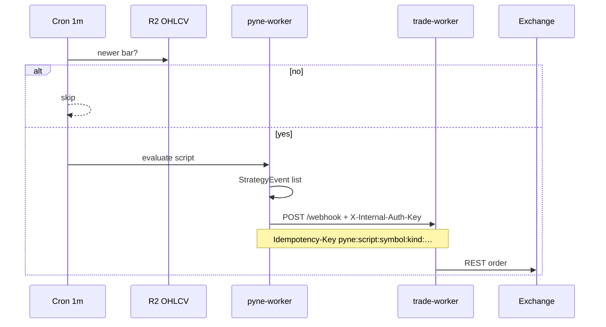

<!--
  Copyright (c) 2026 HOOX · jango-blockchained (hoox-sh)
  SPDX-License-Identifier: CC-BY-4.0
-->

---
title: "PYNE live trading"
description: "Bar-close cron: PYNE strategy events become HOOX WebhookPayloads on trade-worker. Alerts are a separate webhook path."
---

# PYNE live trading

Deploy **pyne-worker**, register a strategy, give it R2 bars, and let the 1-minute cron re-run on new closes. `StrategyEvent` rows map to HOOX actions and hop to **trade-worker** over `TRADE_SERVICE`. This is the supported Pine → order path.

<Warning>
  Test with `test: true` / testnet keys first. `close_all` becomes **two** payloads (`CLOSE_LONG` and `CLOSE_SHORT`).
</Warning>

## Abstract

pyne-worker vendors `pynescript` (`hoox-pyne`) and speaks the same [evaluate contract](https://hoox.sh/pyne/docs/api/contract) as Flask `POST /run` (`mode` interpret \| compile \| auto). It is a **tooling isolate**: public `/run` uses `X-API-Key` (`API_KEY`), not mesh `INTERNAL_KEY_BINDING`. The mesh key is sent **only** on the trade hop.

## Conceptual model



### Event map (`trade_forwarder.py`)

| `StrategyEvent.kind` | HOOX `action` |
| --- | --- |
| `entry` + long | `LONG` |
| `entry` + short | `SHORT` |
| `close` / `exit` + long | `CLOSE_LONG` |
| `close` / `exit` + short | `CLOSE_SHORT` |
| `close_all` | `CLOSE_LONG` **and** `CLOSE_SHORT` |
| `order` | mapped from direction |

Idempotency: `pyne:{script}:{symbol}:{kind}:{direction}:{bar}:{time}:{action}`.

### Alert path (not orders)

`alert()` / `alertcondition()` → JSON `type: pine_alert`, `source: pyne-worker` to `ALERT_WEBHOOK_URL` or per-job `webhook_url`. HTTPS + public host only (SSRF fail-closed). Discord-style `content` is supported. **Does not** hit trade-worker unless you point the webhook at the gateway yourself.

## Interface surface

### Secrets

```bash
hoox secrets set pyne-worker API_KEY
hoox secrets set pyne-worker INTERNAL_KEY_BINDING   # live TRADE_SERVICE
hoox secrets set pyne-worker ALERT_WEBHOOK_URL      # optional
hoox secrets set pyne-worker DEFAULT_EXCHANGE       # optional
hoox secrets set dashboard PYNE_API_KEY             # match API_KEY
```

### Deploy and health

```bash
hoox pyne deploy
hoox pyne health
# or: hoox deploy worker pyne-worker
```

### Operator CLI

`hoox pyne {health,run,scripts,cron,feed,ingest,sync-vendor,deploy}`

Caps (isolate): 5 MB body, 100 KB script, 100 K bars, `/run` wall 30 s. Rate limit 100 req / 60 s per key.

## Internals

| Piece | Path / binding |
| --- | --- |
| Worker | `workers/pyne-worker` (submodule) |
| R2 | `OHLCV_DATA` |
| Trade hop | `TRADE_SERVICE` → trade-worker `POST /webhook` |
| Cron | `* * * * *` — skip if R2 has no newer bar |
| Language | vendored `pynescript.runtime` |

KV: pyne `dashboard.jsonc` is **secrets only** (`API_KEY`, `ALERT_WEBHOOK_URL`). Cron and `TRADE_SERVICE` are wrangler, not CONFIG_KV.

## Invariants

1. Same-symbol `request.security` may work; **foreign / missing feed → `na`**. The isolate will not invent bars to force a trade.
2. Unset `API_KEY` is open **dev** mode — do not ship that.
3. Without `INTERNAL_KEY_BINDING`, live forwards are rejected by `requireInternalAuth`.
4. Paid Workers is recommended for a 1-minute cron; free-tier limits apply.

## Worked examples

1. `hoox pyne deploy` and `hoox pyne health`.
2. `hoox pyne ingest` (or `/ingest`) a testnet symbol.
3. `hoox pyne scripts` — register a **strategy** with tiny size.
4. `hoox pyne cron` — enable the job.
5. Confirm trade-worker test fills, then remove `test: true`.

Language-level event fields: [PYNE strategy events](https://hoox.sh/pyne/docs/runtime/events). Alert frequency: [PYNE alerts](https://hoox.sh/pyne/docs/runtime/alerts).

## Failure modes

| Symptom | Cause | Fix |
| --- | --- | --- |
| `/run` 401 | Bad `X-API-Key` | Match `API_KEY` |
| Events in `/run` JSON, no order | Missing `TRADE_SERVICE` / internal key | Set `INTERNAL_KEY_BINDING` |
| Cron idle | R2 has no new bar | `hoox pyne feed` / ingest |
| Alert fired, no fill | Alert path ≠ trade path | Expected |
| AXIS showed the same script | AXIS does not execute | This page, not the PWA |

## See also

- [pyne-worker isolate](/docs/devops/workers/pyne-worker)
- [trade-worker](/docs/devops/workers/trade-worker)
- [Test trading](/docs/enduser/guides/test-trading)
- [Ecosystem](/docs/enduser/concepts/ecosystem)
- [AXIS and HOOX](/docs/enduser/guides/axis-and-hoox)
- [Evaluate scripts](https://hoox.sh/pyne/docs/enduser/guides/evaluate-scripts)
